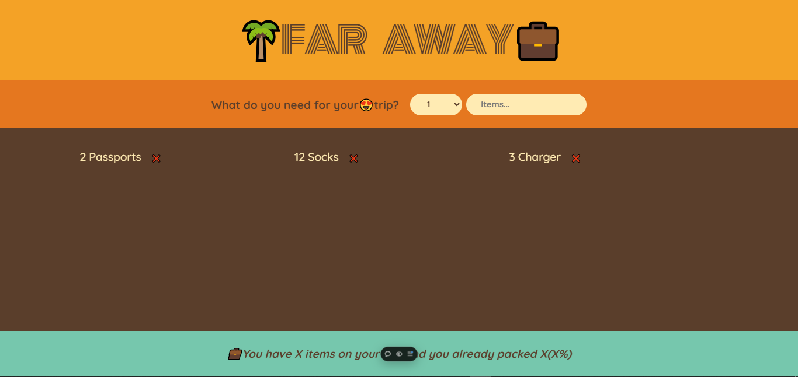

# travel-items-tracker

An App That Keeps Track of Your Travel Items



## Live Site

Check out the live site [here](https://travel-items-tracker.vercel.app/).

## Description

Travel Items Tracker is a simple React application built with Vite that helps you keep track of items you need to pack for your travels. You can add items with their names and quantities, and they will be displayed in a list.

## Features

- Input field to enter the item name.
- Select field to choose the quantity.
- Add button to add the item to the list.
- Displays a list of added items.
- Check button to mark items as completed.
- Remove button to delete items from the list.
- A Footer that tracks the number of items on your list, and your already packed items(in percentage%)

## Technologies Used

- React: A JavaScript library for building user interfaces.
- Vite: A build tool that aims to provide a faster and leaner development experience for modern web projects.
- CSS: For styling the application.
- JavaScript (ES6+): The programming language used for the application logic.

## Setup

1. **Clone the repository:**

   ```bash
   git clone https://github.com/Hallowdread/travel-items-tracker.git
   cd travel-items-tracker
   ```

2. **Install dependencies:**

   ```bash
   npm install
   ```

3. **Start the development server:**

   ```bash
   npm run dev
   ```

4. **Build the project for production:**

   ```bash
   npm run build
   ```

5. **Preview the production build:**
   ```bash
   npm run preview
   ```

## Project Structure

Here's an overview of the project structure:

```arduino
travel-items-tracker/
├── node_modules/
├── public/
│   └── vite.svg
├── src/
│   ├── App.jsx
│   ├── index.css
│   └── main.jsx
│
├── .gitignore
├── .eslint.config.js
├── index.html
├── package-lock.json
├── package.json
├── README.md
├── travel-items-tracker.PNG
└── vite.config.js
```

## Usage

- Enter the name of the item in the input field.
- Select the quantity from the dropdown.
- Click the "Add" button to add the item to the list.
- Use the check button next to an item to mark it as completed (crossed out).
- Use the "X" button next to an item to remove it from the list.

## Contributing

Contributions are welcome! Please feel free to submit a Pull Request.
